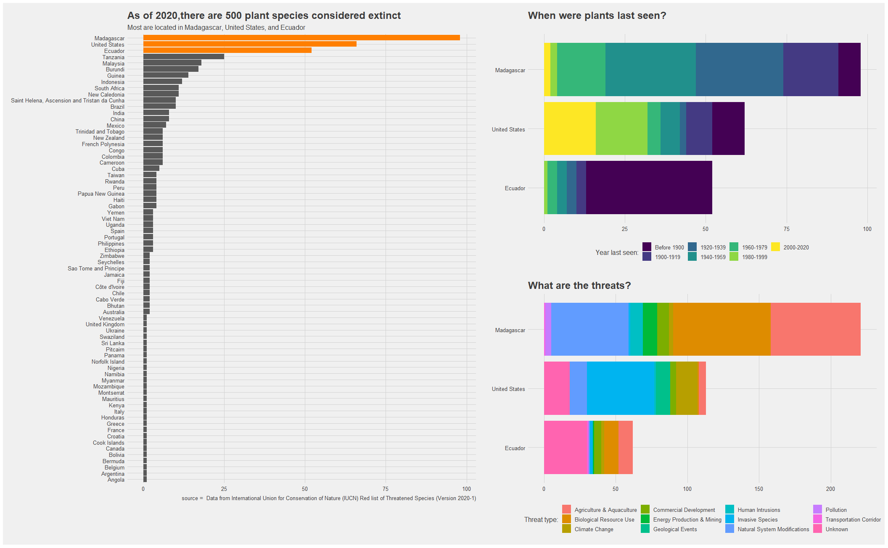

# Load the weekly Data

Download the weekly data and make available in the `tt` object.


```r
tt <- tt_load("2020-08-18")
```

```
## --- Compiling #TidyTuesday Information for 2020-08-18 ----
```

```
## --- There are 3 files available ---
```

```
## --- Starting Download ---
```

```
## 
## 	Downloading file 1 of 3: `plants.csv`
## 	Downloading file 2 of 3: `threats.csv`
## 	Downloading file 3 of 3: `actions.csv`
```

```
## --- Download complete ---
```

# Pull data


```r
plants <- tt$plants
threats <- tt$threats
actions <- tt$actions
```

# View plants data


```r
head(plants)
```

```
## # A tibble: 6 x 24
##   binomial_name country continent group year_last_seen threat_AA threat_BRU
##   <chr>         <chr>   <chr>     <chr> <chr>              <dbl>      <dbl>
## 1 Abutilon pit~ Pitcai~ Oceania   Flow~ 2000-2020              0          0
## 2 Acaena exigua United~ North Am~ Flow~ 1980-1999              0          0
## 3 Acalypha dik~ Congo   Africa    Flow~ 1940-1959              0          0
## 4 Acalypha rub~ Saint ~ Africa    Flow~ Before 1900            1          1
## 5 Acalypha wil~ Cook I~ Oceania   Flow~ 1920-1939              1          0
## 6 Acer hilaense China   Asia      Flow~ 1920-1939              0          0
## # ... with 17 more variables: threat_RCD <dbl>, threat_ISGD <dbl>,
## #   threat_EPM <dbl>, threat_CC <dbl>, threat_HID <dbl>, threat_P <dbl>,
## #   threat_TS <dbl>, threat_NSM <dbl>, threat_GE <dbl>, threat_NA <dbl>,
## #   action_LWP <dbl>, action_SM <dbl>, action_LP <dbl>, action_RM <dbl>,
## #   action_EA <dbl>, action_NA <dbl>, red_list_category <chr>
```

```r
tail(plants)
```

```
## # A tibble: 6 x 24
##   binomial_name country continent group year_last_seen threat_AA threat_BRU
##   <chr>         <chr>   <chr>     <chr> <chr>              <dbl>      <dbl>
## 1 Wikstroemia ~ United~ North Am~ Flow~ 2000-2020              0          0
## 2 Xanthostemon~ New Ca~ Oceania   Flow~ Before 1900            0          0
## 3 Xylopia capu~ Madaga~ Africa    Flow~ 1940-1959              1          1
## 4 Xylosma serr~ Montse~ North Am~ Flow~ 1980-1999              0          0
## 5 Zanthoxylum ~ Madaga~ Africa    Flow~ 1980-1999              1          1
## 6 Zingiber mac~ Indone~ Asia      Flow~ Before 1900            1          1
## # ... with 17 more variables: threat_RCD <dbl>, threat_ISGD <dbl>,
## #   threat_EPM <dbl>, threat_CC <dbl>, threat_HID <dbl>, threat_P <dbl>,
## #   threat_TS <dbl>, threat_NSM <dbl>, threat_GE <dbl>, threat_NA <dbl>,
## #   action_LWP <dbl>, action_SM <dbl>, action_LP <dbl>, action_RM <dbl>,
## #   action_EA <dbl>, action_NA <dbl>, red_list_category <chr>
```

```r
# view plants structure
str(plants)
```

```
## tibble [500 x 24] (S3: spec_tbl_df/tbl_df/tbl/data.frame)
##  $ binomial_name    : chr [1:500] "Abutilon pitcairnense" "Acaena exigua" "Acalypha dikuluwensis" "Acalypha rubrinervis" ...
##  $ country          : chr [1:500] "Pitcairn" "United States" "Congo" "Saint Helena, Ascension and Tristan da Cunha" ...
##  $ continent        : chr [1:500] "Oceania" "North America" "Africa" "Africa" ...
##  $ group            : chr [1:500] "Flowering Plant" "Flowering Plant" "Flowering Plant" "Flowering Plant" ...
##  $ year_last_seen   : chr [1:500] "2000-2020" "1980-1999" "1940-1959" "Before 1900" ...
##  $ threat_AA        : num [1:500] 0 0 0 1 1 0 0 0 0 1 ...
##  $ threat_BRU       : num [1:500] 0 0 0 1 0 0 0 0 0 1 ...
##  $ threat_RCD       : num [1:500] 0 0 0 0 1 1 1 0 0 1 ...
##  $ threat_ISGD      : num [1:500] 1 1 0 1 1 0 1 1 0 0 ...
##  $ threat_EPM       : num [1:500] 0 0 1 0 0 0 0 0 0 0 ...
##  $ threat_CC        : num [1:500] 0 0 0 0 0 0 0 0 0 0 ...
##  $ threat_HID       : num [1:500] 0 0 0 0 0 0 0 0 0 0 ...
##  $ threat_P         : num [1:500] 0 0 0 0 0 0 0 0 0 0 ...
##  $ threat_TS        : num [1:500] 0 0 0 0 1 0 0 0 0 1 ...
##  $ threat_NSM       : num [1:500] 0 0 0 0 0 0 0 0 0 0 ...
##  $ threat_GE        : num [1:500] 1 0 0 0 0 0 0 1 0 0 ...
##  $ threat_NA        : num [1:500] 0 0 0 1 0 0 0 0 1 0 ...
##  $ action_LWP       : num [1:500] 1 0 0 0 0 0 0 1 0 0 ...
##  $ action_SM        : num [1:500] 1 0 0 0 0 1 0 0 0 0 ...
##  $ action_LP        : num [1:500] 0 0 0 0 0 0 0 0 0 0 ...
##  $ action_RM        : num [1:500] 1 1 0 0 0 0 0 1 0 0 ...
##  $ action_EA        : num [1:500] 0 0 0 0 0 0 0 0 0 0 ...
##  $ action_NA        : num [1:500] 0 0 1 1 1 0 1 0 1 1 ...
##  $ red_list_category: chr [1:500] "Extinct in the Wild" "Extinct" "Extinct" "Extinct" ...
##  - attr(*, "spec")=
##   .. cols(
##   ..   binomial_name = col_character(),
##   ..   country = col_character(),
##   ..   continent = col_character(),
##   ..   group = col_character(),
##   ..   year_last_seen = col_character(),
##   ..   threat_AA = col_double(),
##   ..   threat_BRU = col_double(),
##   ..   threat_RCD = col_double(),
##   ..   threat_ISGD = col_double(),
##   ..   threat_EPM = col_double(),
##   ..   threat_CC = col_double(),
##   ..   threat_HID = col_double(),
##   ..   threat_P = col_double(),
##   ..   threat_TS = col_double(),
##   ..   threat_NSM = col_double(),
##   ..   threat_GE = col_double(),
##   ..   threat_NA = col_double(),
##   ..   action_LWP = col_double(),
##   ..   action_SM = col_double(),
##   ..   action_LP = col_double(),
##   ..   action_RM = col_double(),
##   ..   action_EA = col_double(),
##   ..   action_NA = col_double(),
##   ..   red_list_category = col_character()
##   .. )
```

```r
# glimpse
glimpse(plants)
```

```
## Rows: 500
## Columns: 24
## $ binomial_name     <chr> "Abutilon pitcairnense", "Acaena exigua", "Acalyp...
## $ country           <chr> "Pitcairn", "United States", "Congo", "Saint Hele...
## $ continent         <chr> "Oceania", "North America", "Africa", "Africa", "...
## $ group             <chr> "Flowering Plant", "Flowering Plant", "Flowering ...
## $ year_last_seen    <chr> "2000-2020", "1980-1999", "1940-1959", "Before 19...
## $ threat_AA         <dbl> 0, 0, 0, 1, 1, 0, 0, 0, 0, 1, 0, 0, 1, 1, 0, 0, 0...
## $ threat_BRU        <dbl> 0, 0, 0, 1, 0, 0, 0, 0, 0, 1, 1, 1, 1, 0, 1, 0, 0...
## $ threat_RCD        <dbl> 0, 0, 0, 0, 1, 1, 1, 0, 0, 1, 0, 0, 0, 1, 0, 0, 0...
## $ threat_ISGD       <dbl> 1, 1, 0, 1, 1, 0, 1, 1, 0, 0, 0, 0, 0, 0, 0, 0, 0...
## $ threat_EPM        <dbl> 0, 0, 1, 0, 0, 0, 0, 0, 0, 0, 0, 0, 0, 0, 0, 0, 0...
## $ threat_CC         <dbl> 0, 0, 0, 0, 0, 0, 0, 0, 0, 0, 0, 0, 0, 0, 0, 0, 0...
## $ threat_HID        <dbl> 0, 0, 0, 0, 0, 0, 0, 0, 0, 0, 0, 0, 0, 0, 0, 0, 0...
## $ threat_P          <dbl> 0, 0, 0, 0, 0, 0, 0, 0, 0, 0, 0, 0, 0, 0, 0, 0, 0...
## $ threat_TS         <dbl> 0, 0, 0, 0, 1, 0, 0, 0, 0, 1, 0, 0, 0, 0, 0, 0, 0...
## $ threat_NSM        <dbl> 0, 0, 0, 0, 0, 0, 0, 0, 0, 0, 0, 0, 0, 0, 0, 0, 0...
## $ threat_GE         <dbl> 1, 0, 0, 0, 0, 0, 0, 1, 0, 0, 0, 0, 0, 0, 0, 0, 0...
## $ threat_NA         <dbl> 0, 0, 0, 1, 0, 0, 0, 0, 1, 0, 0, 0, 0, 0, 0, 1, 1...
## $ action_LWP        <dbl> 1, 0, 0, 0, 0, 0, 0, 1, 0, 0, 1, 0, 0, 0, 0, 0, 0...
## $ action_SM         <dbl> 1, 0, 0, 0, 0, 1, 0, 0, 0, 0, 0, 0, 0, 0, 0, 0, 0...
## $ action_LP         <dbl> 0, 0, 0, 0, 0, 0, 0, 0, 0, 0, 0, 0, 0, 0, 0, 0, 0...
## $ action_RM         <dbl> 1, 1, 0, 0, 0, 0, 0, 1, 0, 0, 0, 0, 0, 0, 0, 0, 0...
## $ action_EA         <dbl> 0, 0, 0, 0, 0, 0, 0, 0, 0, 0, 0, 0, 0, 0, 0, 0, 0...
## $ action_NA         <dbl> 0, 0, 1, 1, 1, 0, 1, 0, 1, 1, 0, 1, 1, 1, 1, 1, 1...
## $ red_list_category <chr> "Extinct in the Wild", "Extinct", "Extinct", "Ext...
```

```r
# is each binomial name unique?
length(unique(plants[["binomial_name"]])) 
```

```
## [1] 500
```

```r
# which countries are in plants?
n_distinct(plants$country) # there are 72 countries
```

```
## [1] 72
```

```r
unique(plants$country) # and here are the 72 country names
```

```
##  [1] "Pitcairn"                                    
##  [2] "United States"                               
##  [3] "Congo"                                       
##  [4] "Saint Helena, Ascension and Tristan da Cunha"
##  [5] "Cook Islands"                                
##  [6] "China"                                       
##  [7] "Venezuela"                                   
##  [8] "Zimbabwe"                                    
##  [9] "Madagascar"                                  
## [10] "Ethiopia"                                    
## [11] "Ecuador"                                     
## [12] "Mexico"                                      
## [13] "Guinea"                                      
## [14] "Tanzania"                                    
## [15] "Malaysia"                                    
## [16] "South Africa"                                
## [17] "Taiwan"                                      
## [18] "Burundi"                                     
## [19] "Sao Tome and Principe"                       
## [20] "Côte d'Ivoire"                               
## [21] "Spain"                                       
## [22] "Trinidad and Tobago"                         
## [23] "Gabon"                                       
## [24] "Nigeria"                                     
## [25] "Angola"                                      
## [26] "Belgium"                                     
## [27] "United Kingdom"                              
## [28] "Peru"                                        
## [29] "Colombia"                                    
## [30] "Brazil"                                      
## [31] "Indonesia"                                   
## [32] "Papua New Guinea"                            
## [33] "New Caledonia"                               
## [34] "Viet Nam"                                    
## [35] "Rwanda"                                      
## [36] "Mauritius"                                   
## [37] "Ukraine"                                     
## [38] "Myanmar"                                     
## [39] "Cuba"                                        
## [40] "Cameroon"                                    
## [41] "India"                                       
## [42] "Panama"                                      
## [43] "Sri Lanka"                                   
## [44] "Honduras"                                    
## [45] "Philippines"                                 
## [46] "Uganda"                                      
## [47] "Bermuda"                                     
## [48] "Australia"                                   
## [49] "Mozambique"                                  
## [50] "Swaziland"                                   
## [51] "Bhutan"                                      
## [52] "Portugal"                                    
## [53] "French Polynesia"                            
## [54] "Bolivia"                                     
## [55] "Kenya"                                       
## [56] "Cabo Verde"                                  
## [57] "Fiji"                                        
## [58] "Greece"                                      
## [59] "New Zealand"                                 
## [60] "Haiti"                                       
## [61] "Jamaica"                                     
## [62] "Canada"                                      
## [63] "Seychelles"                                  
## [64] "Croatia"                                     
## [65] "Namibia"                                     
## [66] "Yemen"                                       
## [67] "Italy"                                       
## [68] "Chile"                                       
## [69] "Argentina"                                   
## [70] "Norfolk Island"                              
## [71] "France"                                      
## [72] "Montserrat"
```

```r
plants %>%
  group_by(country) %>%
  summarise(percentage = n()/500) %>%
  arrange(desc(percentage))
```

```
## `summarise()` ungrouping output (override with `.groups` argument)
```

```
## # A tibble: 72 x 2
##    country       percentage
##    <chr>              <dbl>
##  1 Madagascar         0.196
##  2 United States      0.132
##  3 Ecuador            0.104
##  4 Tanzania           0.05 
##  5 Malaysia           0.036
##  6 Burundi            0.034
##  7 Guinea             0.028
##  8 Indonesia          0.024
##  9 New Caledonia      0.022
## 10 South Africa       0.022
## # ... with 62 more rows
```

```r
# which continents are in plants?
n_distinct(plants$continent) # there are 6 continents
```

```
## [1] 6
```

```r
unique(plants$continent) # and here are the 6 continent names
```

```
## [1] "Oceania"       "North America" "Africa"        "Asia"         
## [5] "South America" "Europe"
```

```r
# what groups are in plants?
n_distinct(plants$group) # there are 6 groups
```

```
## [1] 6
```

```r
unique(plants$group) # and here are the 6 plant names
```

```
## [1] "Flowering Plant"  "Ferns and Allies" "Cycad"            "Mosses"          
## [5] "Algae"            "Conifer"
```

```r
# what red list categories are in plants?
n_distinct(plants$red_list_category) # there are 2 groups in this data frame for plants that are considered to be in danger
```

```
## [1] 2
```

```r
unique(plants$red_list_category) # the group labels are "Extinct in the wild" or "Extinct"
```

```
## [1] "Extinct in the Wild" "Extinct"
```

```r
# How is year_last_seen measured? it looks like it is a character string
n_distinct(plants$year_last_seen)
```

```
## [1] 8
```

```r
unique(plants$year_last_seen) # looks like 8 date ranges in increments of 19 years
```

```
## [1] "2000-2020"   "1980-1999"   "1940-1959"   "Before 1900" "1920-1939"  
## [6] "1960-1979"   "1900-1919"   NA
```

# Data visualization - where are the plants in most danger located?


```r
plot1 <- plants %>%
  group_by(country) %>%
  summarize(n = n()) %>%
  mutate(highlight_flag = ifelse(country %in% c("Madagascar", "United States", "Ecuador"), T, F)) %>%
  ggplot(aes(reorder(country,n), n, fill = highlight_flag)) +
  geom_bar(stat = "identity", show.legend = F) +
  coord_flip() +
  theme_fivethirtyeight() +
  labs(
    title = "As of 2020,there are 500 plant species considered extinct",
    subtitle = "Most are located in Madagascar, United States, and Ecuador",
    caption = "source =  Data from International Union for Conservation of Nature (IUCN) Red list of Threatened Species (Version 2020-1)",
    x = "Country",
    y = "Red List Category"
    ) +
  scale_fill_manual(values = c('#595959', 'darkorange1'))
```

```
## `summarise()` ungrouping output (override with `.groups` argument)
```

```r
plot1
```

<!-- -->
# Data Visualization - When where the plants last seen for countries with the most extinct plants?


```r
# select only countries with most extinct plants 

plants_small <-
  plants %>%
  filter(country %in% c("Madagascar", "United States", "Ecuador"))

# create ordered variables for graphing

plants_small$year_last_seen_factor_ordered <- factor(plants_small$year_last_seen, ordered = TRUE, 
                                levels = c("Before 1900", "1900-1919", "1920-1939", "1940-1959", "1960-1979", "1980-1999", "2000-2020"))

plants_small$country_ordered <- factor(plants_small$country,levels = c("Ecuador", "United States", "Madagascar"))

# plot

plot2 <- plants_small %>%
  filter(!is.na(year_last_seen_factor_ordered)) %>%
  ggplot(aes(country_ordered, fill = year_last_seen_factor_ordered)) +
  geom_bar() +
  theme_fivethirtyeight() +
  labs(
    title = "When were plants last seen?",
    fill = "Year last seen:"
    ) +
  theme(legend.position = "bottom") +
  coord_flip()

plot2
```

<!-- -->

# Data visualization - what are the threats for the plants that are in most danger?


```r
# focus  on countries with most extinct plants

threats_small <- threats %>%
   filter(country %in% c("Madagascar", "United States", "Ecuador"))

# create ordered variables

threats_small$country_ordered <- factor(threats_small$country, levels = c("Ecuador", "United States", "Madagascar"))

# plot

plot3 <- threats_small %>%
  filter(threatened == 1) %>%
  ggplot(aes(country_ordered, fill = threat_type)) +
  geom_bar() +
  theme_fivethirtyeight() +
  labs(
    title = "What are the threats?",
    fill = "Threat type:"
    ) +
  theme(legend.position = "bottom") +
  coord_flip()

plot3
```

<!-- -->

# Data visualization - side by side by side

```r
plot1 + (plot2/plot3)
```

<!-- -->
