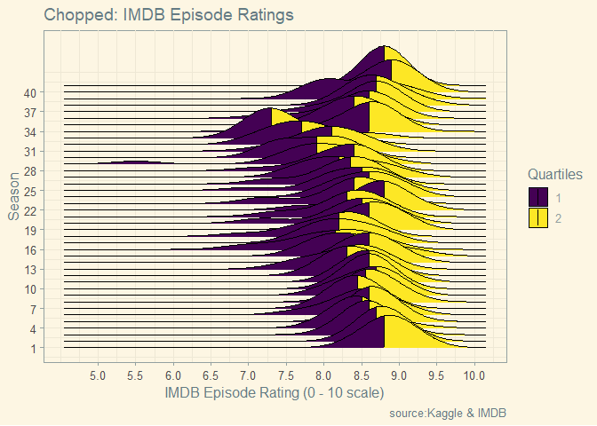

# TidyTuesday


# Load the weekly Data

Download the weekly data and make available in the `tt` object.


```r
tt <- tt_load("2020-08-25")
```

```
## --- Compiling #TidyTuesday Information for 2020-08-25 ----
```

```
## --- There is 1 file available ---
```

```
## --- Starting Download ---
```

```
## 
## 	Downloading file 1 of 1: `chopped.tsv`
```

```
## --- Download complete ---
```


# Pull Tibble

Pull the tibble from the `tt` object.


```r
chopped <- tt$chopped

class(chopped)
```

```
## [1] "spec_tbl_df" "tbl_df"      "tbl"         "data.frame"
```

# Wrangle and Visualize


```r
# plot
chopped %>%
  filter(season <= 42) %>% # removing seasons with the majority of episode ratings missing; note there are still episodes missing in seasons included in plot, per warning message
  ggplot(aes(x = episode_rating, y = season, group = season, fill = factor(stat(quantile)))) +
  stat_density_ridges(
    geom = "density_ridges_gradient", 
    calc_ecdf = TRUE, # needed for calculating quantiles; cumulative
    quantiles = 2, quantile_lines = TRUE, # specifies number of quantiles
    scale = 6 # determines amount of overlap between the density plots
    ) +
  scale_fill_viridis_d(name = "Quartiles") +
  scale_x_continuous(breaks=seq(5,10,.5)) +
  scale_y_continuous(breaks=seq(1,42,3)) +
  labs(
      title = "Chopped: IMDB Episode Ratings",
      x = "IMDB Episode Rating (0 - 10 scale)",
      y = "Season",
      caption = "source:Kaggle & IMDB"
      ) +
  theme_solarized()
```

```
## Picking joint bandwidth of 0.315
```

```
## Warning: Removed 68 rows containing non-finite values (stat_density_ridges).
```

<!-- -->
